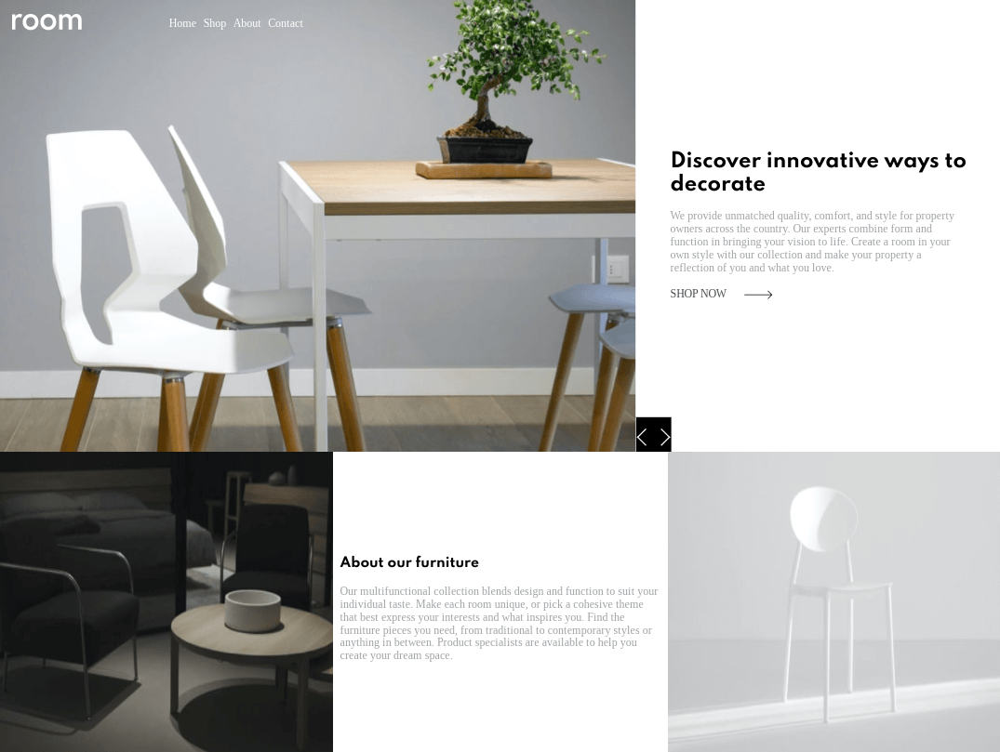
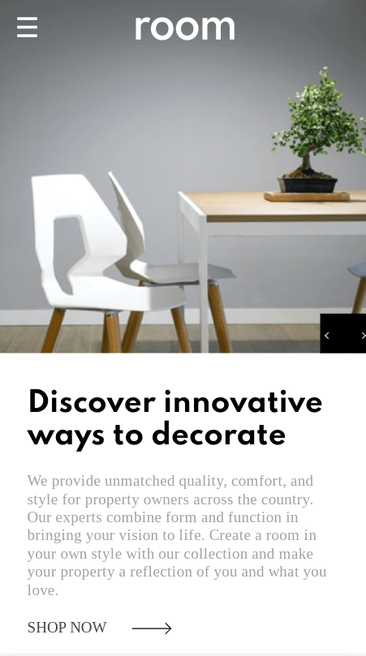
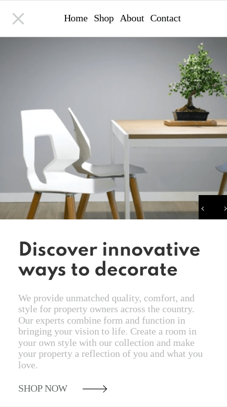

# Frontend Mentor - Room homepage solution

This is a solution to the [Room homepage challenge on Frontend Mentor](https://www.frontendmentor.io/challenges/room-homepage-BtdBY_ENq). Frontend Mentor challenges help you improve your coding skills by building realistic projects.

## Table of contents

- [Overview](#overview)
  - [The challenge](#the-challenge)
  - [Screenshot](#screenshot)
  - [Links](#links)
- [My process](#my-process)
  - [Built with](#built-with)
  - [What I learned](#what-i-learned)
  - [Continued development](#continued-development)
  - [Useful resources](#useful-resources)

## Overview

### The challenge

Users should be able to:

- View the optimal layout for the site depending on their device's screen size
- See hover states for all interactive elements on the page
- Navigate the slider using either their mouse/trackpad or keyboard

### Screenshot

### Links

- Live Site URL: [Github Pages](https://jdegand.github.io/room-homepage)

## My process

### Built with

- CSS custom properties
- Flexbox
- Grid
- jQuery
- GSAP

### What I learned

- Using someone else's code gave me a headstart and improved my recognition of code.    

### Continued development

- Semantic HTML5 markup
- Duplicated ul for desktop because the ul would not display as display: none was being inherited and using 'display: flex !important' on the ul broke the mobile version.  
- Sizing is off but font-size should never be as low as 12px.
- Spartan font-style takes a lot of space ?
- Have to refresh to get sizing right.
- Tablet screen size is a mess.
- Arrows were mocked up for 1440px x 1080px - poor implementation of absolute positioning

### Useful resources

- [Codepen](https://codepen.io/gvrban/pen/qjbpaa) - jquery & gsap slider
- [Codepen](https://codepen.io/g13nn/pen/eHGEF) - jquery hamburger
- [Stack Overflow](https://stackoverflow.com/questions/38598278/browser-refresh-on-screen-size) - Browser refresh on screen size change
- [Stack Overflow](https://stackoverflow.com/questions/36531708/why-can-absolutely-positioned-elements-make-areas-scrollable) - Overflow left vs right differences
